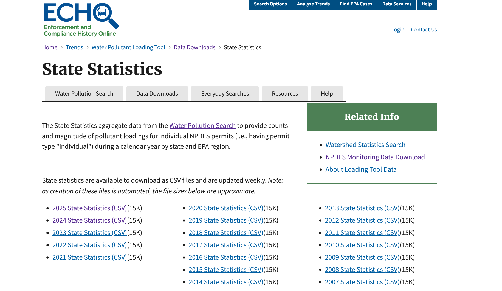

# NPDES Water Pollution by State: EPA 2024 

**The State Statistics aggregate data from the Water Pollution Search to provide counts and magnitude of pollutant loadings for individual NPDES permits (i.e., having permit type "individual") during a calendar year by state and EPA region.**




## Variable Definitions by the EPA 

**Reporting Year**

The calendar year of the reported pollutant discharges. The Water Pollutant Loading Tool calculates annual pollutant loadings from DMR data reported for monitoring periods within a calendar year.

**EPA Region**

The EPA designated area that U.S. States, territories, and tribes are assigned to. There are 10 EPA regions.

**Number of Majors in ICIS-NPDES**

The number of individual NPDES permits (permit type = individual) with major designations.

**Number of Non-Majors in ICIS-NPDES**

The number of individual NPDES permits with non-major designations.

**Percent of Majors with Pollutant Loadings**

The percent of individual NPDES permits with major designations in a state with pollutant loadings greater than zero.

**Percent of Non-Majors with Pollutant Loadings**

The percent of individual NPDES permits with non-major designations in a state with pollutant loadings greater than zero.

**Total Pollutant Loading (lb/year) for Majors**

The total calculated pollutant loadings, in pounds per year, for individual NPDES permits with major designations.

**Total Pollutant Loading (lb/year) for Non-Majors**

The total calculated pollutant loadings, in pounds per year, for individual NPDES permits with non-major designations.

**Total Toxic-Weighted Pounds (lb-eq/year) for Majors**

The total calculated relative toxicities of pollutant loadings, as toxic-weighted pound equivalents per year, for individual NPDES permits with major designations.

**Total Toxic-Weighted Pounds (lb-eq/year) for Non-Majors**
The total calculated relative toxicities of pollutant loadings, as toxic-weighted pound equivalents per year, for individual NPDES permits with non-major designations

```{r warning=F, echo=F, message=F}
library(tidyverse)
library(ggplot2)
```

```{r message=F, warning=F, echo=F}

stats <- read.csv("./data/discharge_state.csv")

view(stats)

stats <- na.omit(stats)
```


```{r message=F, warning=F, echo=F}
stats$region <- tolower(stats$State)

stats$Total_Pollutants <- rowSums(stats[, c("Total.Pollutant.Pounds..lb.yr..for.Majors", 
                                      "Total.Pollutant.Pounds..lb.yr..for.Non.Majors")], na.rm = TRUE)

```


---


## Choropleth Map of Total Pollutants Discharged by State, according to NPDES permit data 

### What is Choropleth Map? 
Type of thematic map where areas are shaded or colored in proportion to the value of a specific variable.
 
### Results 
California and Idaho have the top pollutant pounds discharged. Interestingly, the population size of California is 23x more then the population of Idaho. More research should be conducted at water pollutant sites, especially NPDES permits aimed at major designations. 

The map below visualizes total pollutant discharge (in pounds per year) aggregated by state. Darker colors represent higher pollutant loads.

```{r message=F, warning=F, echo=F}
states_map <- map_data("state")
map_stats <- left_join(states_map, stats, by = "region")

ggplot(map_stats, aes(long, lat, group = group, fill = Total_Pollutants)) +
  geom_polygon(color = "white") +
  scale_fill_viridis_c() +
  labs(title = "Total Pollutant Pounds Discharged by State", fill = "Pounds") +
  theme_classic()

```

---

## Top 10 States by Toxic-Weighted Discharges for Majors

```{r message=F, warning=F, echo=F}
df_top <- stats %>%
  arrange(desc(`Total.Toxic.Weighted.Pounds..lb.eq.yr..for.Majors`)) %>%
  slice(1:10)

ggplot(df_top, aes(x = reorder(State, `Total.Toxic.Weighted.Pounds..lb.eq.yr..for.Majors`),
                   y = `Total.Toxic.Weighted.Pounds..lb.eq.yr..for.Majors`)) +
  geom_bar(stat = "identity", fill = "firebrick") +
  coord_flip() +
  labs(title = "Top 10 States by Toxic-Weighted Discharges (Majors)",
       x = "State", y = "Toxic Pounds (lb-eq/yr)") +
  theme_classic()

```

---

## Comparing Major and Non-Major Pollutant Discharges 

```{r message=F, warning=F, echo=F}
ggplot(stats, aes(x = `Total.Pollutant.Pounds..lb.yr..for.Majors`,
               y = `Total.Pollutant.Pounds..lb.yr..for.Non.Majors`)) +
  geom_point(color = "darkgreen") +
  geom_smooth(method = "lm", se = FALSE) +
  labs(title = "Majors vs. Non-Majors Pollutant Discharges",
       x = "Majors (lb/yr)", y = "Non-Majors (lb/yr)") +
  theme_classic()

```

---

## Distribution of Pollutant Load Reporting 

```{r message=F, warning=F, echo=F}
df_long <- stats %>%
  select(State,
         `Majors.w..Pollutant.Loadings`,
         `Non.Majors.w..Pollutant.Loadings`) %>%
  pivot_longer(-State, names_to = "Category", values_to = "Percentage")

ggplot(df_long, aes(x = Category, y = Percentage)) +
  geom_boxplot(fill = "skyblue") +
  labs(title = "Distribution of Pollutant Loading Reporting", x = "", y = "% with Loadings") +
  theme_classic()


```

---

## Total Pollutant Pounds Discharged by EPA Region 

```{r message=F, warning=F, echo=F}
df_region <- stats %>%
  group_by(`EPA.Region`) %>%
  summarise(Total_Discharge = sum(`Total.Pollutant.Pounds..lb.yr..for.Majors`, na.rm = TRUE) +
                                 sum(`Total.Pollutant.Pounds..lb.yr..for.Non.Majors`, na.rm = TRUE))

ggplot(df_region, aes(x = factor(`EPA.Region`), y = Total_Discharge)) +
  geom_bar(stat = "identity", fill = "steelblue") +
  labs(title = "Total Discharges by EPA Region", x = "EPA Region", y = "Total Pounds") +
  theme_classic()

```

<div style="text-align:right; font-size: 12px;">
Prepared by: **Sonya Doubledee** | February 2025  
Data Source: EPA ECHO Database
</div>


